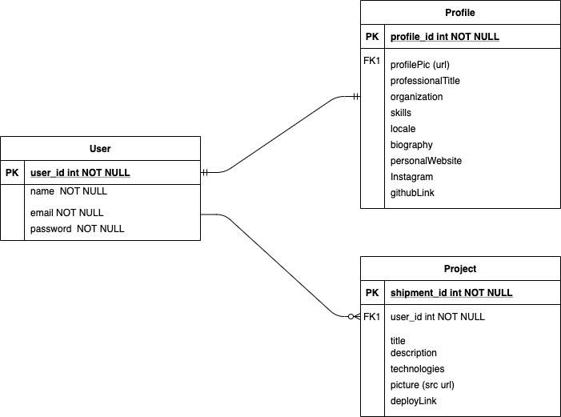
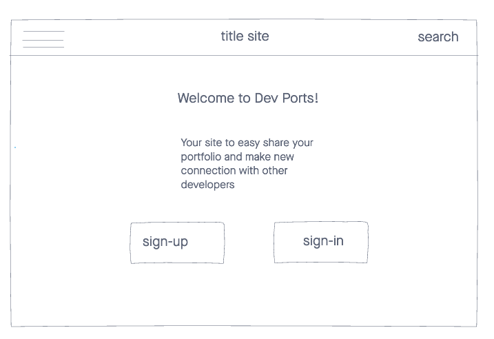
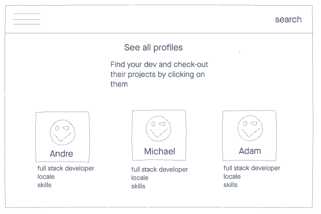
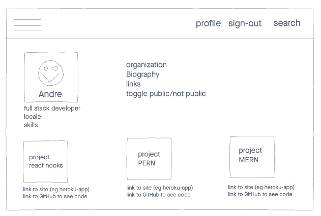

# portfolio-host

Date: December 4, 2020

By: Collin Didier, Luis Rojas and Lisa Venneker Wand

Collin Didier
[GitHub](https://github.com/CDidier80) |
[LinkedIn](https://www.linkedin.com/in/collin-didier/) |
[site](www./.com)

Luis Rojas
[GitHub](https://github.com/lrojash) |
[LinkedIn](https://www.linkedin.com/in/luisrojashuerta) |
[site](www./.com)

Lisa Venneker Wand
[GitHub](https://github.com/LisaKVW) |
[LinkedIn](https://www.linkedin.com/in/lisa-venneker-wand-8413ab25/) |
[site](www./.com)

## Description
Site for developers to host their portfolio and projects

## Technologies used

## How to get started
Start by signing up a new user and then begin add your projects to your profile.

A Trello board was used to keep track of the groups progress and can be viewed.

The project itself will be deployed using Heroku.

## User Stories
1. Users can create an account with their email and name.
2. A User can login into his/her account.
3. From users profile, the user can share his/her:
- professional title
- organization 
- skills
- locale
- biography
- share his/her projects
- share LinkedIn account link
- GitHub link
- person site link
- about me section 
- contact information.
4. User projects shared will show an image and link of his/her app/site.
5. User can choose if he/she wants to share contact details.
6. Users will be able to view other developer profiles on the home page.

## ERD

## Wireframe

## Screenshots
Screenshots of site to follow upon launch

## Code snippet
Code Snippet of API

## Trello link
https://trello.com/b/xMfBTgOV/portfolio-host 

## API link's

## Credits

## Future updates
- Mutliple templates for users to display their profile.

